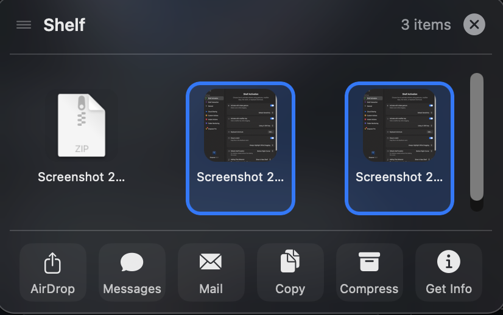
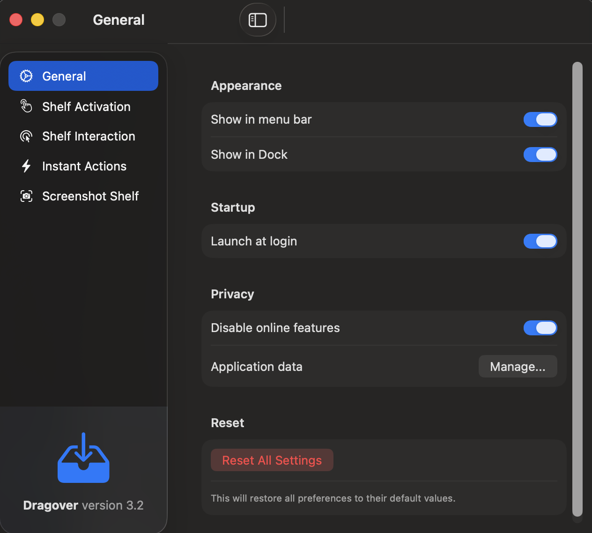
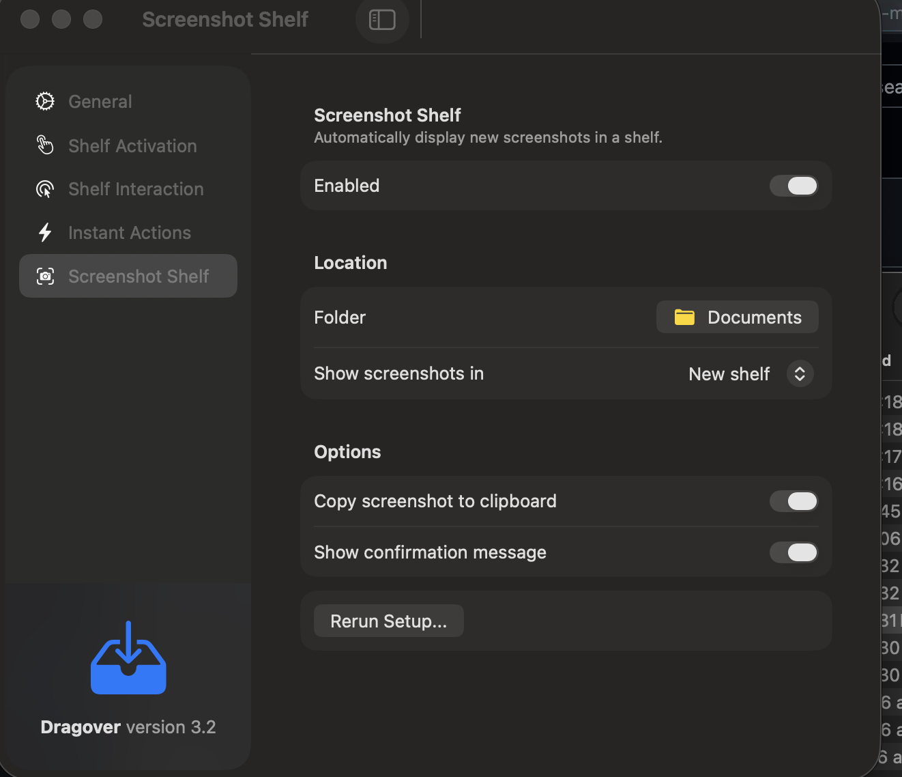

# Dragover

A native macOS drag-and-drop shelf application for temporary file storage during multi-step workflows.

## Features

- **Floating Shelf**: A translucent, edge-aware shelf that appears when needed
- **Multiple Activation Methods**:
  - Cursor shake while dragging
  - Hold Shift/Option while dragging
  - Drag to MacBook notch area
  - Keyboard shortcuts (Global & Local)
- **Instant Actions**: Quick actions like AirDrop, Messages, Mail, Copy, Compress, Get Info
- **Quick Look**: Preview files instantly with spacebar or right-click
- **Visual Selection Feedback**: Clear blue highlight and context menu for selected items
- **Screenshot Capture**: Automatically capture new screenshots into a shelf
- **Full Offline Support**: No network connectivity required

---

## Main Shelf

A floating shelf appears instantly during drag operations and allows you to temporarily hold files before dropping them into apps or folders.

---
## Settings - General

Fully configurable behavior for activation, shelf interaction, and screenshot handling.


---
## Settings - Shelf Activation


---
## Settings - Screenshot Shelf


---
## Settings - Instant Actions


---
## Requirements

- macOS 13.0 or later
- Xcode 15.0 or later
- Apple Silicon or Intel Mac

## Building

### Using Xcode

1. Open `Dragover.xcodeproj` in Xcode
2. Select the "Dragover" scheme
3. Build (⌘B) or Run (⌘R)

### Using Command Line

```bash
# Build for current architecture
xcodebuild -scheme Dragover -configuration Release build

# Build Universal Binary (Intel + Apple Silicon)
xcodebuild -scheme Dragover -configuration Release ARCHS="arm64 x86_64" build
```

The built app will be located in the derived data directory.

## Permissions

Dragover requires the following system permissions:

### Accessibility (Required)
- **Purpose**: Detect drag gestures and cursor movements globally
- **How to Grant**: System Preferences → Privacy & Security → Accessibility → Add Dragover

### Screen Recording (Optional)
- **Purpose**: Only needed for screenshot shelf feature
- **How to Grant**: System Preferences → Privacy & Security → Screen Recording → Add Dragover

## Architecture

```
Dragover/
├── App/                    # App entry points
│   ├── DragoverApp.swift   # SwiftUI App lifecycle
│   └── AppDelegate.swift   # AppKit delegate for system integration
├── Models/                 # Data models
│   ├── Shelf.swift         # Shelf container
│   └── ShelfItem.swift     # Individual shelf items
├── Services/               # Business logic
│   ├── PreferencesManager  # UserDefaults-backed settings
│   ├── ShelfManager        # Shelf lifecycle management
│   ├── DragDetectionService # Cursor/drag monitoring
│   ├── NotchDetectionService # MacBook notch detection
│   ├── ScreenshotMonitorService # Screenshot folder watcher
│   ├── PermissionService   # System permission handling
│   └── InstantActionService # Action execution
├── Actions/                # Instant action implementations
│   ├── InstantAction.swift # Protocol
│   ├── AirDropAction.swift
│   ├── MessagesAction.swift
│   ├── MailAction.swift
│   ├── CopyAction.swift
│   ├── CompressAction.swift
│   └── GetInfoAction.swift
└── UI/
    ├── Shelf/              # Shelf UI (AppKit + SwiftUI)
    ├── Preferences/        # Settings UI (SwiftUI)
    └── Onboarding/         # Permission setup UI
```

## Usage

1. Launch Dragover
2. Grant Accessibility permission when prompted
3. Start dragging a file from Finder
4. Either:
   - Shake your cursor while dragging
   - Hold Shift while dragging
   - Drag to the notch area (on MacBook Pro with notch)
5. Drop files onto the shelf
6. Use instant actions or drag files back out

## Preferences

Access via ⌘, or the menu bar icon:

- **General**: Menu bar, Dock, launch at login
- **Shelf Activation**: Shake sensitivity, modifier keys, notch activation
- **Shelf Interaction**: Double-click behavior, auto-retract, snap-to-edge
- **Instant Actions**: Enable/disable and reorder actions
- **Screenshot Shelf**: Auto-capture screenshots

## Troubleshooting

### Shelf doesn't appear when shaking
1. Verify Accessibility permission is granted
2. Check "Activate with shake gesture" is enabled in Preferences
3. Try adjusting shake sensitivity

### Drag-and-drop not working
1. Ensure Dragover is running (check menu bar)
2. Verify file access permissions

### Screenshot capture not working
1. Enable "Screenshot Shelf" in Preferences
2. Grant Screen Recording permission
3. Verify the screenshot folder path is correct

## License

Copyright © 2024. All rights reserved.
